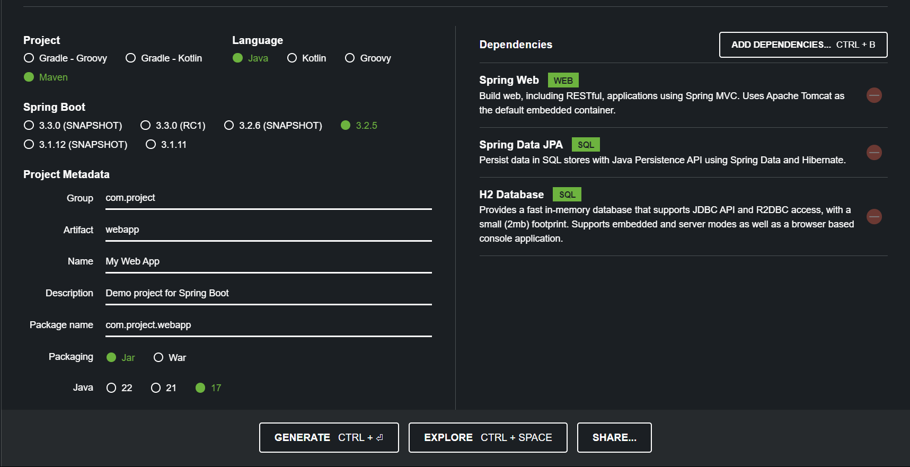

# SpringBoot CRUD

A simple CRUD REST API built with Spring Boot and H2 Database, designed to demonstrate basic REST API development principles.

[](https://www.oracle.com/java/technologies/javase/17-relnote-issues.html)
[](https://spring.io/projects/spring-boot)
[](http://www.h2database.com/html/main.html)


### Project is initialized with [start.spring.io](https://start.spring.io)


## Prerequisites

- Java 17
- Apache Maven
- IDE (such as IntelliJ IDEA or Eclipse) for development

## Installation

1. Clone the repository:

   ```bash
   git clone https://github.com/OmAvhad/sprint-boot-crud.git
    ```

2. Open Project with Intellij

3. Set Up Run Configuration:
- Navigate to "Run" > "Edit Configurations..." from the top menu.
- Click the "+" icon and select "Maven" from the dropdown menu.
- Give your configuration a name.
- In the "Command line" field, type spring-boot:run.
- Click "OK" to save your run configuration.


## API Doc 
* [Spring Boot CRUD](https://documenter.getpostman.com/view/19388406/2sA3JGeivR)